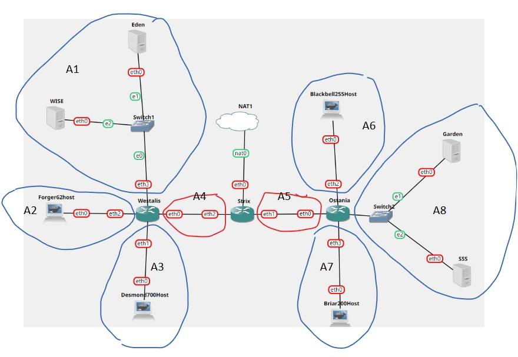
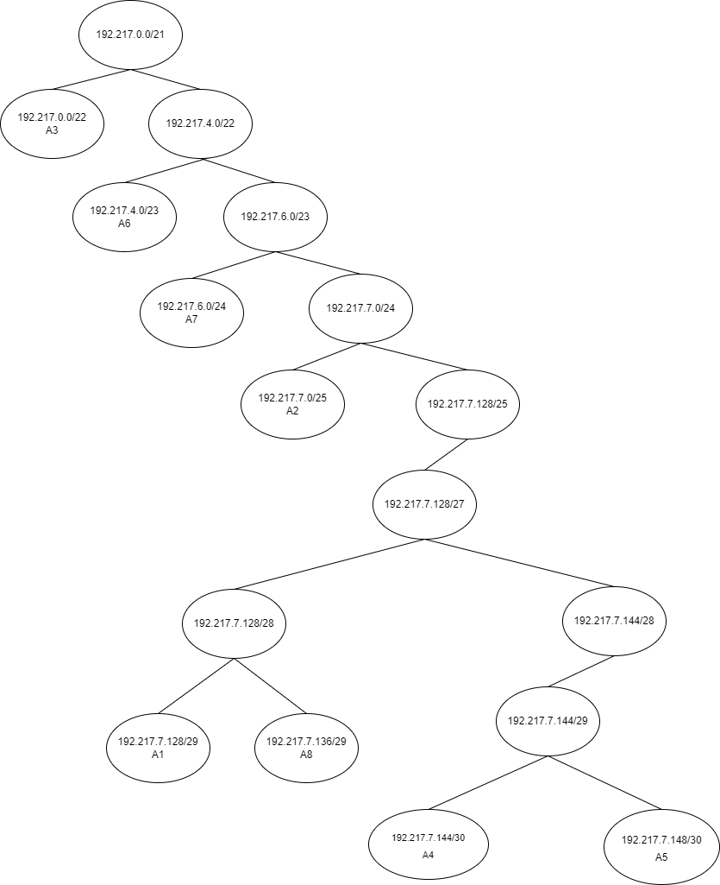
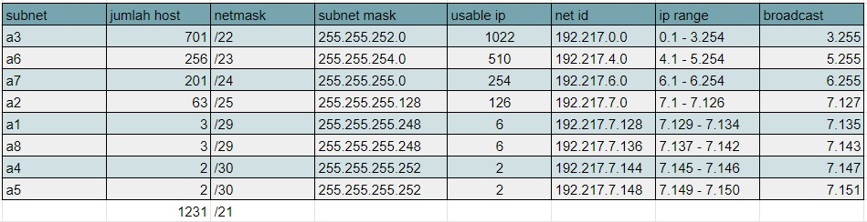
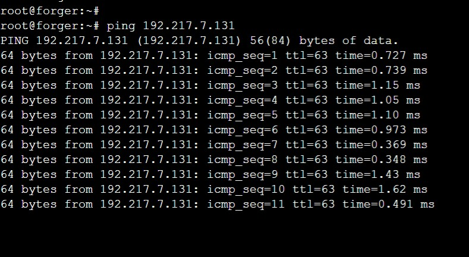
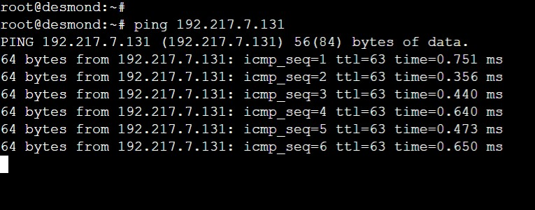
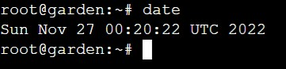
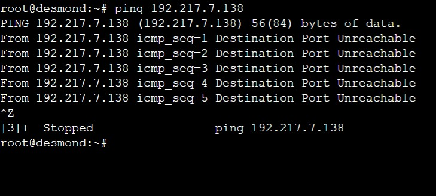

# Jarkom-Modul-5-ITB06-2022

Repository ini dibuat sebagai laporan resmi untuk pengerjaan [Soal Shift Modul 5](https://docs.google.com/document/d/1b-tRRx2BLu1RxCgXxnoI2lYJbG9E0C08adRppePfHxk/edit) dari praktikum Mata Kuliah Komunikasi Data dan Jaringan Komputer.

**Anggota Kelompok ITB06**

- Sarah Hanifah Pontoh 5027201006
- Sharira Saniane 5027201016
- Naufal Dhiya Ulhaq 5027201029

## Subnetting Menggunakan VLSM

Pembagian subnet pada jaringan sebagai berikut:



Jumlan keseluruhan host adalah 1231 sehingga netmask keseluruhan adalah /21. Berikut adalah skema pembagian dalam tree.



Pembagian IP setiap subnet:



## Konfigurasi Node dan Routing

### Strix

```
auto eth0
 iface eth0 inet dhcp

auto eth1
iface eth1 inet static
	address 192.217.1.1
	netmask 255.255.255.0

auto eth2
iface eth2 inet static
	address 192.217.2.1
	netmask 255.255.255.0

auto eth3
iface eth3 inet static
	address 192.217.3.1
	netmask 255.255.255.0
```

Sebagai router yang langsung terhubung dengan NAT, tambahkan route berikut untuk menghubungkan setiap subnet.

```
route add -net 192.217.7.0 netmask 255.255.255.128 gw 192.217.7.146 #forger
route add -net 192.217.0.0 netmask 255.255.252.0 gw 192.217.7.146 #desmond
route add -net 192.217.7.128 netmask 255.255.255.248 gw 192.217.7.146 #eden & WISE

route add -net 192.217.4.0 netmask 255.255.254.0 gw 192.217.7.150 #blackbell
route add -net 192.217.6.0 netmask 255.255.255.0 gw 192.217.7.150 #briar
route add -net 192.217.7.136 netmask 255.255.255.248 gw 192.217.7.150 #garden & SSS
```

Set up sebagai DHCP relay

```
apt-get update
apt-get install isc-dhcp-relay -y
echo '
SERVERS="192.217.7.131"
INTERFACES="eth2 eth1"
OPTIONS=""
' > /etc/default/isc-dhcp-relay
service isc-dhcp-relay restart
```

### Westalis

```
auto eth0
iface eth0 inet static
	address 192.217.7.146
	netmask 255.255.255.252
auto eth1
iface eth1 inet static
	address 192.217.0.1
	netmask 255.255.252.0
auto eth2
iface eth2 inet static
	address 192.217.7.1
	netmask 255.255.255.128
auto eth3
iface eth3 inet static
	address 192.217.7.129
	netmask 255.255.255.248

```

Tambahkan juga route berikut untuk menghubungkan dengan router Strix

```
route add -net 0.0.0.0 netmask 0.0.0.0 gw 192.217.7.145
```

Set up sebagai DHCP relay

```
apt update
apt install isc-dhcp-relay -y
echo '
SERVERS="192.217.7.131"
INTERFACES="eth2 eth3 eth0 eth1"
OPTIONS=""
' > /etc/default/isc-dhcp-relay
service isc-dhcp-relay restart
```

### Ostania

```
auto eth0
iface eth0 inet static
	address 192.217.7.150
	netmask 255.255.255.252
auto eth1
iface eth1 inet static
	address 192.217.7.137
	netmask 255.255.255.248
auto eth2
iface eth2 inet static
	address 192.217.4.1
	netmask 255.255.254.0
auto eth3
iface eth3 inet static
	address 192.217.6.1
	netmask 255.255.255.0
```

Tambahkan juga route berikut untuk menghubungkan dengan router Strix

```
route add -net 0.0.0.0 netmask 0.0.0.0 gw 192.217.7.149
```

Set up sebagai DHCP relay

```
apt update
apt install isc-dhcp-relay -y
echo '
SERVERS="192.217.7.131"
INTERFACES="eth2 eth3 eth1 eth0"
OPTIONS=""
' > /etc/default/isc-dhcp-relay
service isc-dhcp-relay restart
```

### Clients (Forger, Desmond, Blackbell, Briar)

```
auto eth0
iface eth0 inet dhcp
```

### Eden (DNS Server)

```
auto eth0
iface eth0 inet static
	address 192.217.7.130
	netmask 255.255.255.248
        gateway 192.217.7.129
```

Set sebagai DNS server

```
apt update
apt install bind9 -y
```

Pada file `/etc/bind/named.conf.options` tambahkan:

```
options {
        directory "/var/cache/bind";
        forwarders {
                192.168.122.1;
        };
        allow-query { any; };
        auth-nxdomain no;    # conform to RFC1035
        listen-on-v6 { any; };
};
```

```
service bind9 restart
```

### WISE (DHCP Server)

```
auto eth0
iface eth0 inet static
	address 192.217.7.131
	netmask 255.255.255.248
        gateway 192.217.7.129
```

Set sebagai DHCP server

```
apt update
apt install isc-dhcp-server -y
```

Pada `/etc/default/isc-dhcp-server` tambahkan:

```
INTERFACES="eth0"
```

Pada `/etc/dhcp/dhcpd.conf`tambahkan setiap subnet pada jaringan:

```
ddns-update-style none;
option domain-name "example.org";
option domain-name-servers ns1.example.org, ns2.example.org;
default-lease-time 600;
max-lease-time 7200;
log-facility local7;
subnet 192.217.0.0 netmask 255.255.252.0 {
    range 192.217.0.2 192.217.3.254;
    option routers 192.217.0.1;
    option broadcast-address 192.217.3.255;
    option domain-name-servers 192.217.7.130;
    default-lease-time 360;
    max-lease-time 7200;
}
subnet 192.217.7.0 netmask 255.255.255.128 {
    range 192.217.7.2 192.217.7.126;
    option routers 192.217.7.1;
    option broadcast-address 192.217.7.127;
    option domain-name-servers 192.217.7.130;
    default-lease-time 720;
    max-lease-time 7200;
}
subnet 192.217.4.0 netmask 255.255.254.0 {
    range 192.217.4.2 192.217.5.254;
    option routers 192.217.4.1;
    option broadcast-address 192.217.5.255;
    option domain-name-servers 192.217.7.130;
    default-lease-time 720;
    max-lease-time 7200;
}
subnet 192.217.6.0 netmask 255.255.255.0 {
    range 192.217.6.2 192.217.6.254;
    option routers 192.217.6.1;
    option broadcast-address 192.217.6.255;
    option domain-name-servers 192.217.7.130;
    default-lease-time 720;
    max-lease-time 7200;
}
subnet 192.217.7.128 netmask 255.255.255.248 {}
subnet 192.217.7.144 netmask 255.255.255.252 {}
subnet 192.217.7.148 netmask 255.255.255.252 {}
subnet 192.217.7.136 netmask 255.255.255.248 {}
```

```
service isc-dhcp-server restart
```

### Garden (Web Server)

```
auto eth0
iface eth0 inet static
	address 192.217.7.138
	netmask 255.255.255.248
        gateway 192.217.7.137
```

Set sebagai web server

```
apt update
apt install apache2 -y
service apache2 start
echo "$HOSTNAME" > /var/www/html/index.html
```

### SSS

```
auto eth0
iface eth0 inet static
	address 192.217.7.139
	netmask 255.255.255.248
        gateway 192.217.7.137
```

Set sebagai web server

```
apt update
apt install apache2 -y
service apache2 start
echo "$HOSTNAME" > /var/www/html/index.html
```

## Soal 1

Agar topologi yang kalian buat dapat mengakses keluar, kalian diminta untuk mengkonfigurasi Strix menggunakan iptables, tetapi Loid tidak ingin menggunakan MASQUERADE.

Strix

```
IPETH0="$(ip -br a | grep eth0 | awk '{print $NF}' | cut -d'/' -f1)"
iptables -t nat -A POSTROUTING -o eth0 -j SNAT --to-source "$IPETH0" -s 192.217.0.0/21
```

Testing di salah satu client


## Soal 2

Kalian diminta untuk melakukan drop semua TCP dan UDP dari luar Topologi kalian pada server yang merupakan DHCP Server demi menjaga keamanan.

Strix

```
iptables -A FORWARD -d 192.217.7.131 -i eth0 -p tcp --dport 80 -j DROP
iptables -A FORWARD -d 192.217.7.131 -i eth0 -p udp --dport 80 -j DROP
```

## Soal 3

Loid meminta kalian untuk membatasi DHCP dan DNS Server hanya boleh menerima maksimal 2 koneksi ICMP secara bersamaan menggunakan iptables, selebihnya didrop.

WISE (DHCP Server)

```
iptables -A INPUT -p icmp -m connlimit --connlimit-above 2 --connlimit-mask 0 -j DROP
```

Eden (DNS Server)

```
iptables -A INPUT -p icmp -m connlimit --connlimit-above 2 --connlimit-mask 0 -j DROP
```

Testing
Ping WISE/Eden di 3 klien yang berbeda: Forger, Desmond, lalu Briar





Saat ping dari klien ketiga, hasil ping langusng berhenti.

## Soal 4

Akses menuju Web Server hanya diperbolehkan disaat jam kerja yaitu Senin sampai Jumat pada pukul 07.00 - 16.00.

Di web server Garden dan SSS tambahkan code berikut. Forger dan Desmond tidak dapat mengakses web server pada waktu yang ditentukan.

```
#forger
iptables -A INPUT -s 192.217.7.0/25 -m time --weekdays Sat,Sun -j REJECT
iptables -A INPUT -s 192.217.7.0/25 -m time --timestart 00:00 --timestop 06:59 --weekdays Mon,Tue,Wed,Thu,Fri -j REJECT
iptables -A INPUT -s 192.217.7.0/25 -m time --timestart 16:01 --timestop 23:59 --weekdays Mon,Tue,Wed,Thu,Fri -j REJECT

#desmond
iptables -A INPUT -s 192.217.0.0/25 -m time --weekdays Sat,Sun -j REJECT
iptables -A INPUT -s 192.217.0.0/25 -m time --timestart 00:00 --timestop 06:59 --weekdays Mon,Tue,Wed,Thu,Fri -j REJECT
iptables -A INPUT -s 192.217.0.0/25 -m time --timestart 16:01 --timestop 23:59 --weekdays Mon,Tue,Wed,Thu,Fri -j REJECT
```

Testing



Pada waktu tersebut seharusnya Garden tidak dapat diakses.



Desmond tidak dapat mengakses web server Garden.

## Soal 5

Karena kita memiliki 2 Web Server, Loid ingin Ostania diatur sehingga setiap request dari client yang mengakses Garden dengan port 80 akan didistribusikan secara bergantian pada SSS dan Garden secara berurutan dan request dari client yang mengakses SSS dengan port 443 akan didistribusikan secara bergantian pada Garden dan SSS secara berurutan.

Ostania

```
iptables -A PREROUTING -t nat -p tcp -d 192.217.7.130 -m statistic --mode nth --every 2 --packet 0 -j DNAT --to-destination 192.217.7.139:80
iptables -A PREROUTING -t nat -p tcp -d 192.217.7.130 -j DNAT --to-destination 192.217.7.138:80

iptables -A PREROUTING -t nat -p tcp -d 192.217.7.130 -m statistic --mode nth --every 2 --packet 0 -j DNAT --to-destination 192.217.7.138:443
iptables -A PREROUTING -t nat -p tcp -d 192.217.7.130 -j DNAT --to-destination 192.217.7.139:443
```

## Kendala

Nomor 6 masih belum berhasil  
